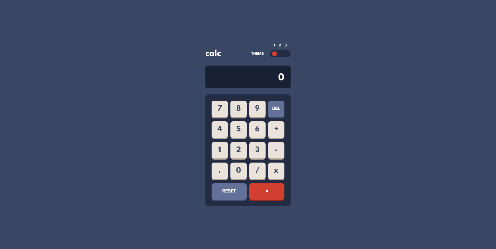

# Frontend Mentor - Calculator app solution

This is a solution to the [Calculator app challenge on Frontend Mentor](https://www.frontendmentor.io/challenges/calculator-app-9lteq5N29). Frontend Mentor challenges help you improve your coding skills by building realistic projects. 

## Table of contents

- [Overview](#overview)
  - [Screenshot](#screenshot)
  - [Links](#links)
- [My process](#my-process)
  - [Built with](#built-with)
  - [What I learned](#what-i-learned)
- [Author](#author)

## Overview

### Screenshot

### Links

- Solution URL: [URL](https://www.frontendmentor.io/solutions/just-a-calculator-2Y3y4FjfsC)
- Live Site URL: [URL](https://unl00ky.github.io/calculator-app/)

## My process

### Built with

- Semantic HTML5 markup
- CSS custom properties
- Flexbox
- CSS Grid
- Mobile-first workflow
- JS

### What I learned
- eval()
- you can select :root
- some properties like .slice(); .includes();  
- use === not ==
- JS is weird sometimes

## Author

- Github - [unl00ky](https://github.com/unl00ky)
- Frontend Mentor - [@unl00ky](https://www.frontendmentor.io/profile/unl00ky)